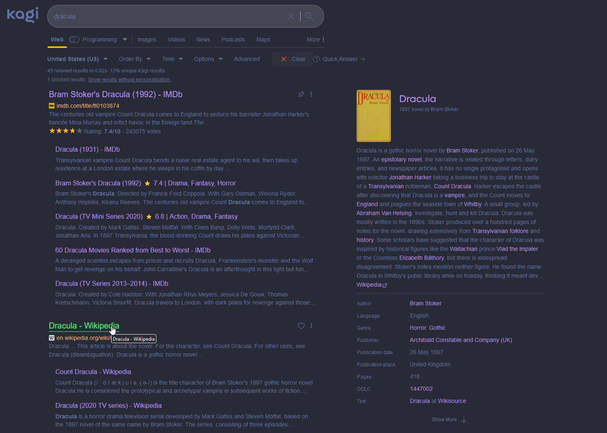

# Dracula theme for Kagi

I hate CSS, but I love [Kagi](https://kagi.com "Kagi")
and [Dracula themes](https://github.com/dracula/dracula-theme "GitHub"), so I tried something.

## Install

Go to [Kagi Settings](https://kagi.com/settings?p=custom_css "Kagi.com"), check `Enable Custom CSS`, paste the content
of `custom-theme.css` in the textarea and save with `Apply Custom CSS`.

Enjoy.

## Sources

Colors from [Dracula themes](https://github.com/dracula/dracula-theme "GitHub").
